# D2 v3.5 约束消费流程图（策略预绑定 A+B 叠加，插件 2.5.0 起）

> 2026-09-04 定稿。与 v3.4 互斥分流的差异：路径 B（G1–G10 双向）从"空绑定专属兜底"改为**全量普适**，与路径 A 叠加；gate 症状④强制 Step 6.5 执行。
> 历史背景：run2r2（qdrant v1.18.0，2026-09-02 会话）全程跳过 Step 6.5，75 约束空绑定 19+ 轮无人察觉，已作废（VOIDED-step65.md）。

```mermaid
flowchart TD
    IN["约束（契约构造阶段产出）<br/>constraint_id / type / endpoint / level / description"]

    LINTGATE{"level lint（缺 level → exit 1）"}
    IN --> LINTGATE
    LINTGATE -- "fail" --> REJ["⛔ exit 1：契约未过 Rule 2.7 分级"]
    LINTGATE -- "pass" --> STAGE2

    subgraph STAGE1["约束分级 Rule 2.7（判据 = 观察模式，非文档章节）"]
        C1{"违规在哪里可观察？"}
        C1 -- "单端点 · 单请求内" --> LE["level = endpoint"]
        C1 -- "多端点 · 跨请求序列" --> LS["level = system"]
    end

    subgraph STAGE2["策略预绑定 bind_strategies.py（确定性代码 · 零 LLM）"]
        LE --> BUILTIN["builtin 基线：按类型无条件映射<br/>type → builtin:type_boundary · range → builtin:boundary_value<br/>state / 新类别 → 无 builtin（形态无确定映射）"]
        LE --> REG{"registry 三条件过滤<br/>① constraint_types 标记<br/>② endpoint 匹配（精确 / * / *+op）<br/>③ active/stable 且有战绩"}
        REG -- "命中" --> REGOK["registry id（同 id 时 target 特化覆盖 global）"]
        REG -- "未命中" --> UNB1["bound_strategies = []<br/>⚠ 仅 state 类 / 新类可达<br/>（type/range 有 builtin 兜底，永不空绑）"]
        BUILTIN --> UNION["bound_strategies 非空 = builtin ∪ registry"]
        REGOK --> UNION
        LS --> UNB2["bound_strategies = []<br/>一律不绑（宽松覆盖）"]
    end

    UNION --> COUT["契约（全部约束已带 bound_strategies，含显式空列表）"]
    UNB1 --> COUT
    UNB2 --> COUT
    COUT --> GATE4{"gate 症状④：_strategy_binding 在位？<br/>（缺失 → Stop 拦停，提示跑 Step 6.5）"}
    GATE4 --> CHUNK["orchestrator 分块派发：每轮 1 chunk<br/>（round R → chunks[R-1]，agent 只攻 unit_ref ∈ chunk）"]

    subgraph STAGE3["测试用例生成（attack-boundary / semantic / state，LLM agent）"]
        CHUNK --> ENTRY{"逐约束处理"}
        AUX["辅助输入：threat model（by-design 清单 /<br/>blindspot / 端点权重）+ reflection_context（exhausted）"]
        AUX --> ENTRY
        ENTRY -- "命中 by-design / exhausted" --> SKIP["SKIPPED: by-design（G3 跳过分支）"]
        ENTRY -- "bound_strategies 非空" --> PA["路径 A · 按绑定列表直生<br/>agent 只执行不决策"]

        ENTRY -- "所有约束（含已绑定）" --> DECIDE["路径 B · 策略在生成时确定<br/>（空列表 = 上游显式声明『形态无确定映射』<br/>→ 决策权移交 LLM agent）"]

        subgraph PINBOX["空绑定约束的策略确定：三个钉子 + 一个弹药库"]
            PIN["三个钉子（零自由度，agent 无权改）：<br/>G1 测什么 = 本约束（constraint_id → Attack: 行）<br/>G4 测几侧 = 正负各 ≥1（共享 setup，缺一即违规）<br/>G7 判什么 = Oracle 从 assertion 文本派生"]
            AMMO["弹药库（唯一自由度 = 具体构造形态）：<br/>① 内建策略目录：state Strategies 1–7 + Patterns A–D ·<br/>boundary 边界/类型边界矩阵 · semantic 行为契约/错误诊断<br/>② 新类别明文判据：resource_bound = spec 合法资源极值 ·<br/>doc_consistency = spec/prose 双侧分别构造 ·<br/>other = 按 assertion + no_fit_reason<br/>③ level 钉形态：endpoint = 单请求 · system = 跨请求序列"]
            PIN --> SEL{"agent 读约束语义<br/>→ 从弹药库选适用构造"}
            AMMO --> SEL
        end
        DECIDE --> PIN

        SEL --> GP["正侧：行使承诺<br/>（含边界闭包 min/max 本身须被接受）"]
        SEL --> GN["负侧：违约形态构造<br/>G6 变异点论证破坏力<br/>G5 分型：Type1 非法成功 / Type3 运行失败 / Type4 状态违规"]
        PA --> ORC
        GP --> ORC["Oracle 先行 G7：期望对齐 assertion<br/>先声明期望，再比对实测"]
        GN --> ORC
        ORC --> V["三出口判定 G8<br/>DEFECT_FOUND / NO_DEFECT / SCRIPT_ERROR<br/>（传输失败先 /healthz 活体复查）"]
        V --> G10N["G10 覆盖停止：chunk 内 applicable 组合 + 全约束 B 对覆盖尽即停"]
        G10N --> STRAT["脚本声明实际所用 strategy + path: A|B<br/>（A/B 独立构造 = 交叉验证：一致→置信，分歧→信号）"]
    end

    STRAT --> S1{"Stage 1 静态错误分类"}
    S1 -- "静态错误" --> RETRY["按 error_class 修正原文件<br/>每脚本 ≤ 2 次"] --> S1
    S1 -- "clean" --> XREV["Step 5 交叉评审"]
    XREV --> EXEC["docker-executor 沙箱执行"]
    EXEC --> NG["novelty_gate（meta.json → NOVEL/KNOWN）"]
    NG --> OUT["evidence-builder → chain-auditor → 终判"]

    SCOPE["📌 范围：本图 = 契约驱动主路径（exploitation）；<br/>两阶段调度的探索阶段（ADR-0009 probe 批次 / 四算子）不在本图<br/>📌 v3.5 变更点：DECIDE/PINBOX 对已绑定约束同样生效（B 普适）；<br/>GATE4 为新增 gate 症状④"]
```

## 讲解要点

1. **GATE4**：v3.5 新增——契约有约束但无 `_strategy_binding` = Step 6.5 被跳过的实证，Stop 拦停（run2r2 教训的机制化）。
2. **A+B 叠加**：路径 A（绑定直生）与路径 B（G 双向）对所有约束**同时**生成；B 的"三个钉子"框定目标与判据，唯一自由度是构造形态（弹药库）。
3. **交叉验证**：A/B 独立构造，一致 → 置信；分歧 → 信号（写进 rationale）。`path: A|B` 进 Attack: 行与 meta.json 供统计分账。
4. **registry 分发修复**：strategy_registry 曾被 gitignore 归为 dev-only 从未进部署链（4b12905 遗留），2.5.0 起随插件分发；当前桩策略惰性（永不绑定），绑定主力是 builtin 基线。
